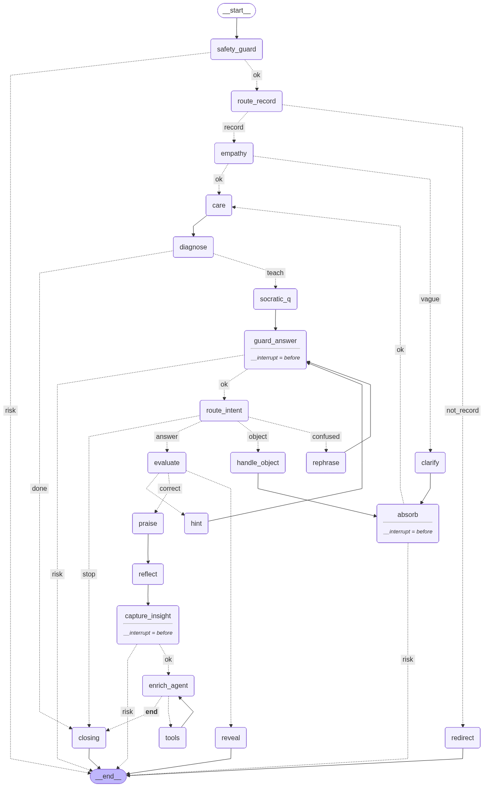

# 셀프케어 코치 (LangGraph Education Agent)

**답을 대신 주지 않고, 내 몸·마음 신호를 스스로 읽을 줄 알게 가르치는** 교육형 코치.
오늘의 기록(식단·수면·번아웃·운동)을 넣으면 **소크라테스식 질문 → 채점 → 힌트 → 칭찬**으로 스스로 답을 찾게 이끈다.

설계: [../../졸업과제/그래프설계.md](../../졸업과제/그래프설계.md)



## 흐름

```
safety_guard ─(위험? 안내 후 END)─→ empathy ─(애매? clarify →[답 대기]→ absorb)─→ care → diagnose
   diagnose ─(도메인 판별)─→ socratic_q →[답 대기]→ guard_answer ─(위험? END)─→ route_intent
   route_intent ─→ answer: evaluate / object: handle_object / confused: rephrase / stop: closing
   evaluate ─→ correct: praise / wrong·unknown: hint
   hint ─→ (소진? reveal(정답 공개)→END : 재시도)
   praise → enrich_agent ⇄ tools(웹검색) → closing → END
```

## 과제 요구사항 대응

| 요구 | 구현 |
|---|---|
| **노드 3개+** | **18개** |
| **Conditional Edge 1개+** | **9군데** (위험·애매·도메인·의도·채점·힌트·툴호출 …) |
| **Tool 연동 1개+** | `search_web` — `@tool` → `bind_tools` → `ToolNode` → `tools_condition` (#14.1) |
| (선택) 메모리 | **SQLite checkpointer** — 재시작해도 진도 유지 (#14.2) |
| (선택) 여러 도메인 | 식단·수면·번아웃·운동 (개념 9개) |

## 강의 적용

| 강의 | 코치에서 |
|---|---|
| **#9.3 Guardrails** | Input 가드(입력 3지점 전부) + **Output 가드**(코치 응답의 의료 조언·진단 차단) |
| **#14.1 Tool Nodes** | `search_web` 웹검색 — 개념을 **맞힌 뒤에만** 실천 팁 |
| **#14.2 Memory** | **SqliteSaver** — 배운 개념이 재시작 후에도 남는다 |
| **#14.3 Human-in-the-loop** | `interrupt_before=["absorb","guard_answer"]` — 답 대기 |
| **#16.3 Routing** | `route_intent` — 답변/항의/혼란/중단을 갈라서 다르게 처리 |
| **#17 Testing** | pytest + parametrize + 노드 단위 테스트 + **LLM as Judge** |

## 설계 포인트 넷

**1. 개념은 데이터, 그래프는 고정.** 도메인을 아무리 더해도 노드·엣지는 안 늘어난다. `diagnose`가 도메인을 판별하면 `socratic_q → evaluate → praise/hint → enrich` 공통 흐름이 어떤 개념이든 똑같이 처리한다. 대신 복잡함은 **판별 단계로 옮겨간다.**

**2. 넘겨짚지 않는다.** 도메인을 알 수 없는 입력("피곤해")은 `clarify`가 되묻고, 코치가 잘못 짚었으면 `route_intent`가 **항의를 알아듣고** `handle_object`가 사과 후 다시 진단한다.

**3. 안전은 3중.** 키워드(의학 응급) + **Moderation API**(self-harm, 무료) + **Output 가드**(의료 조언 차단). 셋이 각각 다른 걸 잡는다. 의학 응급→119·병원 / 정신적 위기→**109**로 갈래를 나눴다.

**4. 판정은 temperature=0.** 분류·채점(라우팅·evaluate·output guard)은 매번 같은 답이 나와야 한다. 생성(공감·힌트)만 온도를 준다.

## 파일

| 파일 | 내용 |
|---|---|
| `state.py` | `CoachState` (messages는 `add_messages` 리듀서) |
| `concepts.py` | 개념 9개 (식단3·수면2·번아웃2·운동2) + 도메인 키워드 |
| `nodes.py` | 노드 + `@tool` + 가드(입·출력) + Moderation + 라우터 |
| `graph.py` | 그래프 조립 · `build_persistent_graph()`(SQLite) |
| `chat.py` | 대화형 실행 (진도 이어받기) |
| `tests.py` | **pytest + LLM Judge** (강의 #17) |
| `criteria.txt` | 코칭 톤 + 의학 가드레일 규칙 |

## 실행

```bash
uv sync
cp .env.example .env          # OPENAI_API_KEY (없으면 규칙기반 폴백)
python chat.py                # 대화 (진도는 coach_memory.db에 저장)
python -m pytest tests.py -q  # 테스트
```

- LLM: `gpt-4o-mini`. 웹검색: DuckDuckGo(무료). Moderation: OpenAI(무료).
- ⚠️ `coach_memory.db`는 **개인 건강 기록**이라 gitignore. 절대 커밋·배포 금지.

> 이 코치는 학습용입니다. 의료 조언·위기 상담 도구가 아닙니다.
> 몸이 급하면 119 · 마음이 힘들면 자살예방 상담 **109** (24시간, 무료)
