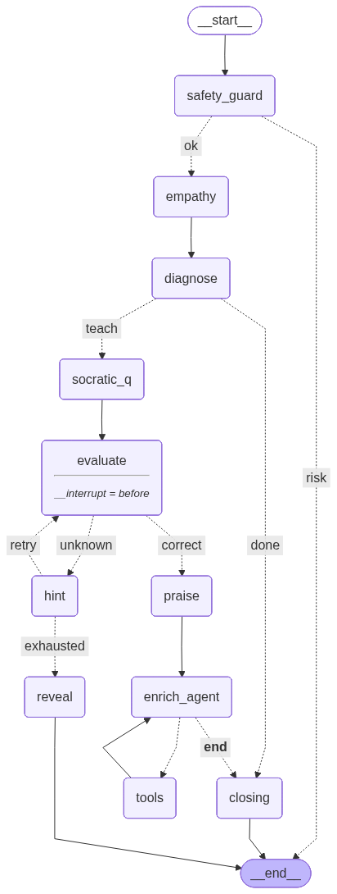

# 셀프케어 코치 (LangGraph Education Agent)

**답을 대신 주지 않고, 내 몸·마음 신호를 스스로 읽을 줄 알게 가르치는** 교육형 코치.
오늘의 기록(식단·수면·번아웃·운동)을 넣으면, 코치가 **소크라테스식 질문 → 채점 → 힌트 → 칭찬**으로 스스로 답을 찾게 이끈다.

설계: [../../졸업과제/그래프설계.md](../../졸업과제/그래프설계.md)



## 흐름 한눈에

```
safety_guard →(위험신호? END)→ empathy → diagnose
   diagnose →(오늘 입력의 도메인 판별)→ socratic_q  →[유저 답 대기]→ evaluate
   evaluate →(correct: praise / wrong·unknown: hint)
   hint →(힌트 소진? reveal(정답 공개)→END : evaluate 재시도)
   praise → enrich_agent ⇄ tools(웹검색) → closing → END
```
- `hint`는 **유저 답을 받아 반응형**으로 유도하고, 소진되면 `reveal`이 **정답을 알려주고** 마무리(가르치는 코치답게 빈손 종료 방지).

## 과제 요구사항 대응

| 요구 | 구현 |
|---|---|
| **노드 3개+** | **11개** — safety_guard·empathy·diagnose·socratic_q·evaluate·praise·hint·**reveal**·closing·**enrich_agent**·**tools** |
| **Conditional Edge 1개+** | **5개** — safety(위험/정상)·diagnose(다 앎/가르침)·evaluate(정답/오답/모름)·hint(재시도/소진)·**enrich_agent(`tools_condition`)** |
| **Tool 연동 1개+** | **`search_web`** (웹검색) — `@tool` 정의 → `bind_tools` → **`ToolNode`** 실행 → `tools_condition` 분기 (강의 #14.1 Tool Nodes 패턴 그대로) |
| (선택) 메모리 | `MemorySaver` checkpointer + `learned` 진도 기억 |
| (선택) 여러 도메인 | `diagnose`가 입력 맥락으로 **식단·수면·번아웃·운동** 중 맞는 개념 선택 |

## 핵심 설계 두 가지

**1. 개념은 데이터, 그래프는 고정.** 도메인(운동·수면…)을 아무리 더해도 노드·엣지는 안 늘어난다.
`diagnose`가 오늘 입력의 도메인을 판별(키워드 우선 → LLM 폴백)해 그 도메인의 안 배운 개념을 고르면,
`socratic_q → evaluate → praise/hint → enrich` 공통 흐름이 **어떤 개념이든 똑같이** 처리한다. → `concepts.py`에 dict만 추가하면 끝.

**2. 웹검색은 "답 주기"가 아니라 "마스터 후 심화".** 스스로 개념을 맞힌 뒤에만
`enrich_agent`가 `search_web` Tool로 실제 실천 팁을 한 줄 붙인다("더 알아보기 · …"). "가르치는 코치" 철학과 안 부딪힘.

## 파일 맵

| 파일 | 내용 |
|---|---|
| `state.py` | `CoachState` — 그래프가 들고 다니는 데이터 (messages는 `add_messages` 리듀서) |
| `concepts.py` | 개념 9개 (식단3·수면2·번아웃2·운동2) + 도메인 판별 키워드 |
| `nodes.py` | 노드 함수 + `@tool search_web` + `bind_tools` + `classify_domain` |
| `graph.py` | LangGraph 조립 (`ToolNode`·`tools_condition`·`interrupt_before`·checkpointer) |
| `criteria.txt` | 코칭 톤 + 의학 가드레일 규칙 |
| `coach_graph.png` | 컴파일된 그래프에서 뽑은 다이어그램 |
| `데모데이_셀프케어코치.ipynb` | 데모데이용 노트북 (설계 + 실행 데모) |

## 실행

```bash
uv sync                       # 의존성 (또는 pip install -e .)
cp .env.example .env          # OPENAI_API_KEY 채우기 (없으면 규칙기반으로 자동 폴백)
python graph.py               # 규칙+LLM 데모 한 흐름 (라면+김밥 → 질문 → 답 → 칭찬 → 웹검색 팁)
```

- LLM: `gpt-4o-mini` (`empathy`·`evaluate`·`closing`·`enrich_agent`). **키 없으면 각 노드가 규칙기반으로 폴백**해서 그래도 돈다.
- 웹검색: DuckDuckGo (무료·무키). 검색 실패 시 `enrich`는 조용히 스킵.

> 개인 로그 실데이터는 절대 커밋·배포 금지 (데모 더미만). — 그래프설계 §5 / criteria.txt
